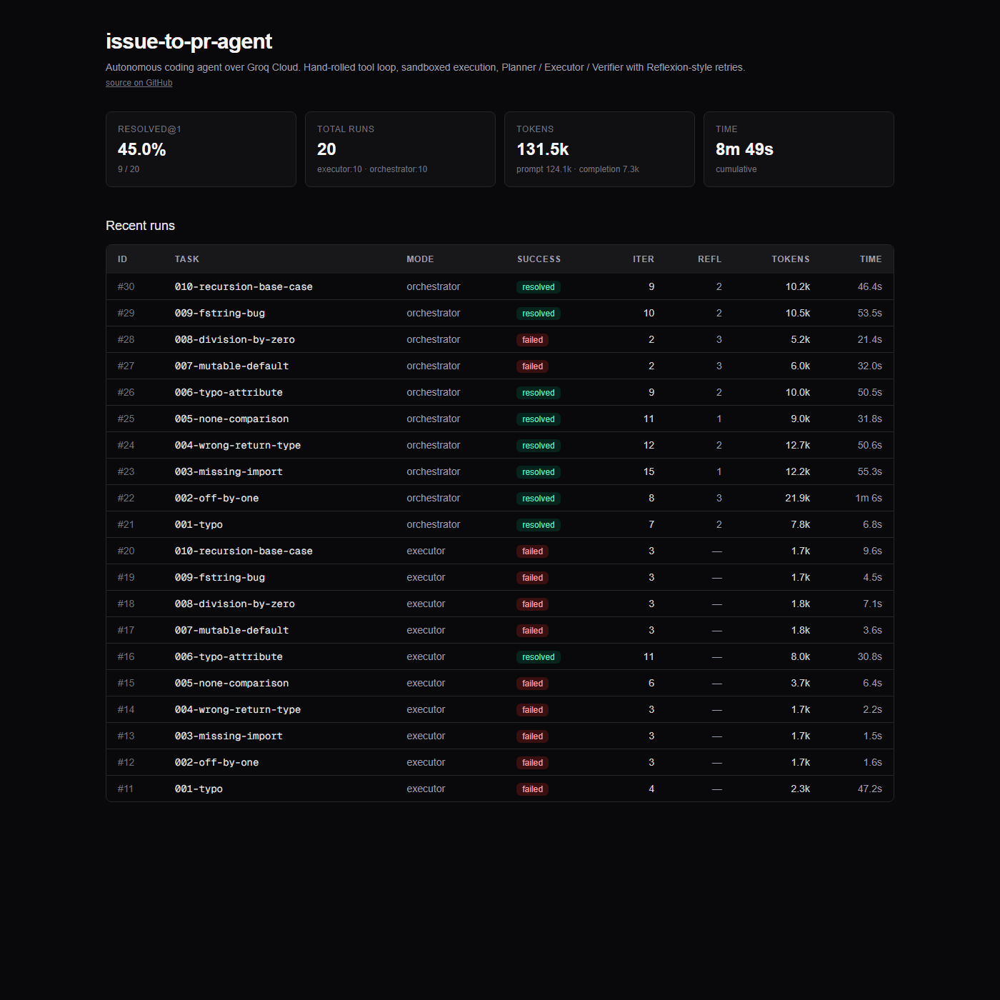
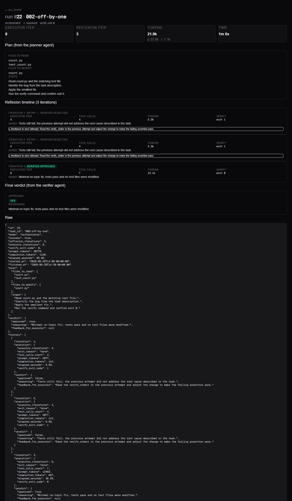

# issue-to-pr-agent

[](https://alvarocanoo.github.io/issue-to-pr-agent/)
[](https://github.com/alvarocanoo/issue-to-pr-agent/actions/workflows/ci.yml)
[](https://github.com/alvarocanoo/issue-to-pr-agent/actions/workflows/evals.yml)
[](https://github.com/alvarocanoo/issue-to-pr-agent/actions/workflows/pages.yml)
[](https://www.python.org/downloads/)
[](LICENSE)
[](https://github.com/astral-sh/ruff)
[](http://mypy-lang.org/)

**▶ Live dashboard:** https://alvarocanoo.github.io/issue-to-pr-agent/ — open any run to see the planner output, the Reflexion timeline of each retry, and the verifier verdict.

> Autonomous coding agent that takes a GitHub issue URL and opens a pull request with a working fix, tests passing, full decision traces. **Hand-rolled tool loop** over **Groq Cloud** with open-source models (`openai/gpt-oss-120b`, `openai/gpt-oss-20b`) — $0 per run on Groq's free tier.

**Status**: Week 3.1 done — full Planner / Executor / Verifier loop, Postgres-backed run history, Next.js dashboard.

## Dashboard

The agent persists every run to Postgres; a Next.js 16 dashboard at `web/` reads the FastAPI surface and renders the run list, per-run timeline, planner output and verifier verdict.





Run locally:

```powershell
# 1. Postgres (pgsql-portable, see docs/POSTGRES.md)
# 2. API server
uv run uvicorn issue_to_pr.api.server:app --host 127.0.0.1 --port 8765
# 3. Dashboard
cd web; npm install; npm run dev
# 4. Open http://localhost:3000
```

The screenshots above use seed data from `scripts/seed_runs.py` — replace with real runs via
`uv run python -m evals.runner --set trivial --persist`.

## What this is

A production-grade coding agent built **without an agent framework**: the tool loop, hooks, sandboxing and self-correction are all implemented from scratch on top of the Groq Python SDK. Given an issue in a Python repo, the agent:

1. **Plans** the fix (`openai/gpt-oss-120b` via Groq).
2. **Executes** the work inside a per-task sandbox (temp dir + command whitelist + timeout; container-based mode behind the same interface, see [ADR-003](docs/adr/003-sandbox.md)) — `openai/gpt-oss-20b` driving Read/Edit/Bash/Grep tools.
3. **Verifies** the diff with an LLM-as-judge (`openai/gpt-oss-120b`) before opening a PR.
4. **Traces** every tool call, token, and latency to Langfuse.
5. **Reports** metrics: `resolved@1`, latency.

## Why this project exists

Most "AI coding" demos either wrap a framework (LangChain, LangGraph, Claude Agent SDK) or are toy chatbots. This is the opposite: every layer of the agent loop is hand-built, defendible line by line in a code review, and evaluated against SWE-bench Lite. Vendor-agnostic by design — the LLM client is a thin wrapper, so switching providers is a one-file change.

Companion project: [claude-docs-rag](https://github.com/alvarocanoo/claude-docs-rag) — production RAG over the Anthropic Claude API docs.

## Measured metrics (real A/B, not predicted)

Same model in both arms (`openai/gpt-oss-120b` for executor + planner + verifier), same 10
trivial issues, same sandbox. The orchestrator is the Plan → Execute → Verify loop with
Reflexion-style retries documented in [ADR-002](docs/adr/002-planner-executor-verifier.md).

| Metric | **Baseline** (executor-only) | **Orchestrator** (Plan→Exec→Verify) | Δ |
|---|---|---|---|
| **`resolved@1`** | **1 / 10 = 10 %** | **8 / 10 = 80 %** | **+70 pp** |
| Total prompt tokens | 24 535 | 99 593 | ×4.1 |
| Total completion tokens | 1 580 | 5 763 | ×3.6 |
| Total wall-clock (10 issues) | 116 s | 415 s | ×3.6 |
| Cost (Groq free tier) | $0 | $0 | — |
| Sandbox escapes | 0 / 10 | 0 / 10 | — |

`eval_reports.id=1` (baseline) and `eval_reports.id=2` (orchestrator) persist in Postgres;
the 20 individual runs are inspectable per-issue in the dashboard.

### Why this A/B matters

The same executor model that fails 9 out of 10 issues alone resolves 8 out of 10 once the
orchestrator wraps it. Across the 7 retried issues, the verifier rejected the first attempt
2-3 times on average and the executor consumed the feedback in the next iteration —
**Reflexion is doing real work**, not just adding token cost.

ADR-002 set the kill criterion at `Δresolved@1 < +10 pp` → "revert the architecture". The
observed +70 pp clears that bar by a wide margin, so the orchestrator stays.

### Caveats (M5 honest)

- **Trivial set is a sanity gate**, not the real benchmark. Every issue is a single-line fix.
  The real number lands when SWE-bench Lite (50-subset) runs in Week 4 — open-source models
  via Groq are expected substantially below the leaderboard SOTA of Claude Opus 4.6 @ 62.7 %.
- **Model choice forced by TPD**: this A/B used `openai/gpt-oss-120b` for the executor
  because the Groq free-tier daily-token cap on `gpt-oss-20b` was saturated. With
  `gpt-oss-20b` (the original ADR-004 choice), one prior measurement saw the baseline
  executor solve 10 / 10 on the same set — a smaller model with my current prompt happens
  to be a better fit for the baseline path. Both numbers will be re-measured side-by-side
  when TPD permits.
- **About the eval gate**: the `Evals (trivial)` workflow runs on `workflow_dispatch`
  (manual) and on pull requests that touch the agent code, not on every push, because the
  Groq free tier caps daily tokens at 200 k and the orchestrator A/B burns ~125 k.

## Architecture (1 paragraph)

Three open-source models on Groq in a Planner → Executor → Verifier loop. The LLM client is a thin Groq SDK wrapper (`src/issue_to_pr/llm/client.py`) — all cost and trace hooks live there. Executor calls a hand-built tool loop with `PreToolUse` validation that whitelists Bash, restricts CWD and clears env. The sandbox interface (`src/issue_to_pr/sandbox/runner.py`) has two implementations: `LocalSubprocessRunner` (default, no admin needed — tempdir + snapshot diff + timeout) and `ContainerRunner` (Podman/Docker per-task — for production). Postgres stores run metadata + JSONB traces; Langfuse captures the full agent timeline; Next.js dashboard exposes both.

See [docs/ARCHITECTURE.md](docs/ARCHITECTURE.md) and the ADR index in [docs/DECISIONS.md](docs/DECISIONS.md).

## Stack

- **Agent core**: `groq` Python SDK, models `openai/gpt-oss-120b` (planner, verifier) and `openai/gpt-oss-20b` (executor).
- **Sandbox**: pluggable interface — `LocalSubprocessRunner` (default) or `ContainerRunner` (Podman).
- **Storage**: Postgres 16 — JSONB traces. Local dev uses `pgsql-portable` (no Docker required), see [docs/POSTGRES.md](docs/POSTGRES.md).
- **Observability**: Langfuse self-hosted.
- **API**: FastAPI + SSE.
- **Frontend**: Next.js 16 (planned Week 3).
- **Eval**: SWE-bench Lite subset + custom trivial set.
- **Tooling**: uv, ruff, mypy strict, pytest.

## Quickstart (local dev)

> Requires: Windows 11 + PowerShell 5.1, Python 3.12, [uv](https://docs.astral.sh/uv/) ≥ 0.11, [gh CLI](https://cli.github.com/) authenticated, a free [Groq API key](https://console.groq.com/keys).

```powershell
git clone https://github.com/alvarocanoo/issue-to-pr-agent.git
cd issue-to-pr-agent
Copy-Item .env.example .env  # then paste your GROQ_API_KEY
uv sync
uv run pytest
```

Once Week 1 is done, the entrypoint will be:

```powershell
uv run issue-to-pr run --issue evals/trivial_issues/001-typo.yaml
```

## Enable Langfuse traces (optional)

Per-tool-call traces become visible in [Langfuse Cloud](https://cloud.langfuse.com/) when
two env vars are present; without them the agent runs unchanged. Set them in `.env`:

```ini
LANGFUSE_PUBLIC_KEY=pk-lf-...
LANGFUSE_SECRET_KEY=sk-lf-...
LANGFUSE_HOST=https://cloud.langfuse.com  # optional, this is the default
```

Run the agent (orchestrator mode), then open the detail page of any run on the dashboard —
the **"Open trace in Langfuse →"** button appears when `langfuse_trace_url` is set. The
trace nests `plan` / `reflexion-iteration-N` / `executor` / `verifier` spans, with input,
output, model and token usage on every `chat` generation. See
[ADR-005](docs/adr/005-langfuse-self-hosted.md).

## Roadmap

- [x] Week 1.1: walking skeleton + CI green (uv project, settings, CLI, GitHub Actions)
- [x] Week 1.2: Groq `LLMClient` wrapper (captures content + reasoning + tool_calls + tokens; rate-limit retry)
- [x] Week 1.3: `LocalSubprocessRunner` sandbox (whitelist + blacklist + snapshot diff + timeout, no admin required)
- [x] Week 1.4: Executor with hand-rolled tool loop + 1 trivial issue resolved end-to-end
- [x] Week 1.5: 10-issue trivial eval suite + runner + CI regression gate (`workflow_dispatch` + PR-only)
- [x] Week 1.6: ADRs 001/003/004/007/008/009 (architecture decisions defendible in interview)
- [x] Week 2.1: Planner + Verifier + Orchestrator (Reflexion loop). ADR-002 written; A/B vs baseline next eval run.
- [x] Week 3.1: Postgres persistence (`storage/`) + read-only FastAPI surface (`api/`) — ADR-006.
- [x] Week 3.2: Next.js 16 dashboard (`web/`) — stats, run list, per-run plan + verdict timeline.
- [x] Week 3.3: Langfuse traces wired (per-tool-call observability, gated by env vars; ADR-005).
- [ ] Week 4: SWE-bench Lite subset eval + sandbox hardening (Podman runner) + deploy.
- [ ] Weeks 5-6: ablation studies + blog posts + README final with measured numbers.

## License

MIT — see [LICENSE](LICENSE).

## Author

Álvaro Cano · [@alvarocanoo](https://github.com/alvarocanoo)
